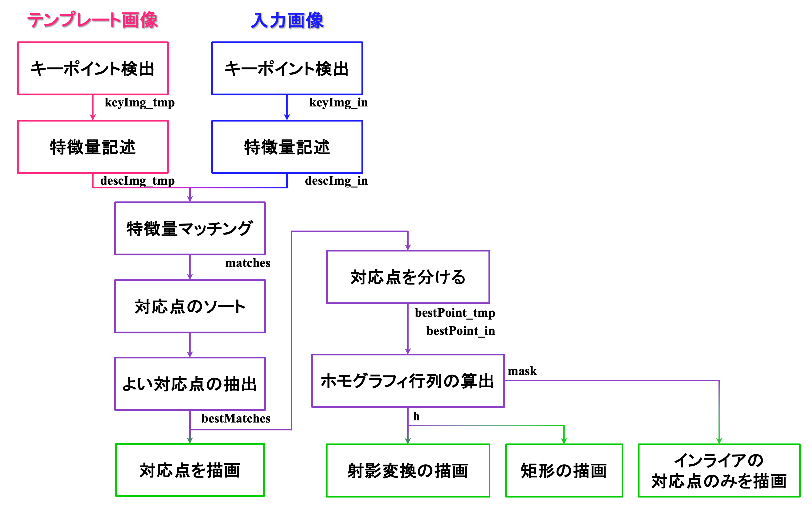
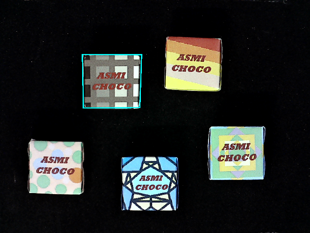
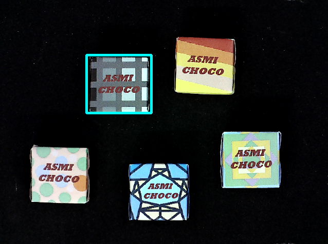
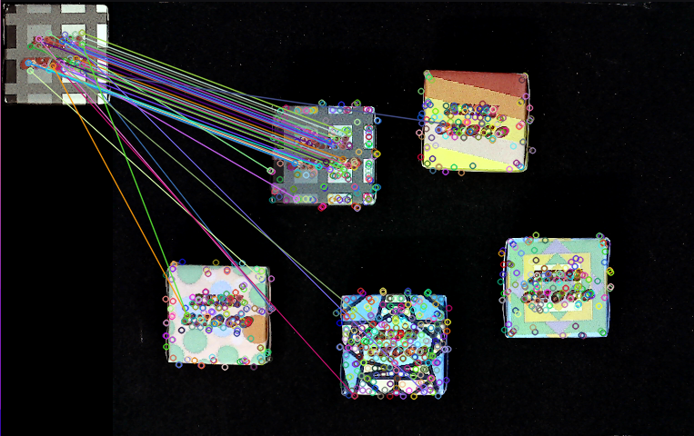
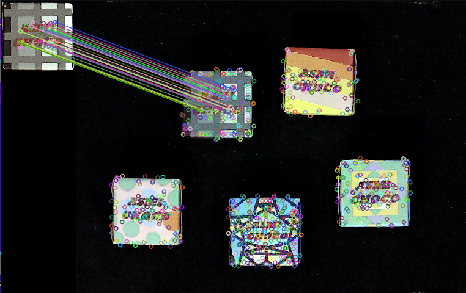

# キーポイントマッチング（AKAZE）のサンプルプログラム
OpenCVライブラリを使用してAKAZEを実行します． 
後処理として，検出した位置を検出することができます． 

## 動作確認済みの環境
OS：`Ubuntu 20.04` 
OpenCV：`3.4.3`

## 事前準備
~~~
$ git clone https://github.com/sakusakueva/KeypointMatching_AKAZE.git
$ cd KeypointMatching_AKAZE
~~~

`KeypointMatching_AKAZE`直下で以下のコマンドを実行する． 
~~~
$ mkdir build
$ cd build
$ cmake ..
$ make -j
$ cd ../
~~~

## 実行
複数のサンプルデータ（`choco`）に対して実行する場合，
~~~
$ bash scripts/run_choco.sh
~~~

1セットのデータ（`choco/data0.png`）に対して実行する場合，
~~~
$ ./keypoint_matching -tmp data/choco/template.png -input data/choco/data0.png -best_match_size=50 -use_color -use_rect -time
~~~

## プログラムの解説
### 処理の流れ

キーポイントマッチングは，
1. キーポイント検出 `detect()`
1. 特徴量記述 `compute()`
1. マッチング `match()`

のステップに分かれており，1. キーポイント検出，2. 特徴量記述は一つの関数`detectAndCompute()`で処理することもできます． 

キーポイント検出後，特徴量の類似度をもとにキーポイントをソートし，上位`best_match_size`個のキーポイントを使ってRANSACを使ってホモグラフィ行列を算出します． 
ホモグラフィ行列を使って射影変換し対象物の位置を求めます． 

なお，正解位置が分かる場合は，`JudgeSuccess()`関数から，検出成功か判定することができます． 

AKAZEのプログラムの詳細は，[こちら](https://docs.opencv.org/3.4/d8/d30/classcv_1_1AKAZE.html)を参照してください．

### 実行結果の描画
#### (1) 検出結果を射影変換で描画する（`--use_project`）

#### (2) 検出結果を射影変換（矩形）で描画する（`--use_rect`）

#### (3) キーポイントマッチングの対応点を描画する（`--use_all`）

#### (4) キーポイントマッチングの対応点のうちインライアのみを描画する（`--use_inlier`）

## コマンドライン引数
|引数|型|デフォルト設定|説明|
|---|---|---|---|
|tmp|cv::String|`data/template.png`|テンプレート画像のパス|
|input|cv::String|`data/data0.png`|入力画像のパス|
|best_match_size|int|`30`|ホモグラフィ行列算出に使用するキーポイント対応数|
|use_color|bool|`false`|モノクロ or カラー|
|use_project|bool|`false`|キーポイントの対応点から射影変換し描画する．|
|use_rect|bool|`false`|キーポイントの対応点から射影変換し矩形を描画する．|
|use_all|bool|`false`|キーポイントの対応点を描画する．|
|use_inlier|bool|`false`|キーポイントの対応点のうちインライアのみを描画する．|
|time <or> t|bool|`false`|処理時間を計測する．|
|help <or> h|bool|`false`|コマンドライン引数の例を表示する．|

